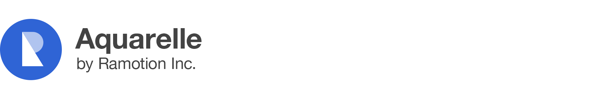

[](https://ramotion.com?utm_source=gthb&utm_medium=special&utm_campaign=aquarelle)
[](https://ramotion.github.io/aquarelle/)

# Aquarelle
[](https://www.codacy.com/app/juri-v/aquarelle?utm_source=github.com&amp;utm_medium=referral&amp;utm_content=Ramotion/aquarelle&amp;utm_campaign=Badge_Grade)
[]()
[](http://twitter.com/Ramotion)
[](https://travis-ci.org/Ramotion/aquarelle)


## About
This project is maintained by Ramotion, Inc.<br>
We specialize in the designing and coding of custom UI for Mobile Apps and Websites.<br>

**Looking for developers for your project?**<br>
This project is maintained by Ramotion, Inc. We specialize in the designing and coding of custom UI for Mobile Apps and Websites.

<a href="https://dev.ramotion.com/?utm_source=gthb&utm_medium=special&utm_campaign=aquarelle-contact-us/"> 
</a> <br>

## Browser support

* Chrome
* Safari
* Opera
* Firefox
* IE 11

## Installation

`bower install aquarelle`

Then insert in your html:

```html
<script src="bower_components/three.js/build/three.js"></script>

<script src="bower_components/aquarelle/Aquarelle.js"></script>

<script src="bower_components/three.js/examples/js/postprocessing/EffectComposer.js"></script>

<script src="bower_components/three.js/examples/js/postprocessing/ClearPass.js"></script>
<script src="bower_components/aquarelle/AquarellePass.js"></script>
<script src="bower_components/three.js/examples/js/postprocessing/ShaderPass.js"></script>
<script src="bower_components/three.js/examples/js/shaders/CopyShader.js"></script>
```


## API

### Constructor

`new Aquarelle(textureImage, maskImage[, options]);`

| Names | Required | Type | Description
| --- | --- | --- | ---
| textureImage | `true` | `string`, `Image` or `` | background image
| maskImage | `true` | `string`, `Image` or `` | background image mask
| options | `false` | `object` | initial options

### Options

| Names | Defaults | Description
| --- | --- | ---
| fromAmplitude | `50` | initial noise amplitude value
| toAmplitude | `0` | final noise amplitude value
| fromFrequency | `8` | initial noise frequiency
| toFrequency | `7` | final noise frequiency
| fromOffset | `-30` | initial mask size
| autoplay | `false` | `true` - start animation before first frame is being rendered
| loop | `false` | `true` - repeat animation in loop
| duration | `8000` | animation duration

### Events

| Names | Description
| --- | ---
| created | triggered before first frame is rendered
| changed | triggered before rendering of a frame
| completed | triggered before latest frame is rendered
| started | triggered before animation is started
| played | triggered after animation is started
| paused | triggered before pause of animation
| stopped | triggered before reset of animation

### Methods

| Names | Description
| --- | ---
| `pause()` | pause animation
| `play()` | start animation
| `stop()` | stop and reset animation
| `start()` | start animation over
| `reverse()` | reverse animation
| `reset()` | re-render frame
| `setOptions([object])` | set animation options
| `transitionInRange(startValue, endValue[, startTimeMS[, endTimeMS]])` | return value between `startValue`..`endValue` in range `startTimeMS`..`endTimeMS`
| `addEventListener(type, listener)` | add listener (`listener`) of event (`type`)
| `removeEventListener(type, listener)` | remove (`listener`) of event (`type`)


## Usage

≈

```javascript
var aquarelle = new Aquarelle(textureImage, maskImage[, options]);
```

##### Listeners

```javascript
function listener(event) {}

aquarelle.addEventListener('created', listener);

aquarelle.removeEventListener('created', listener);
```
##### Demos

[Static demo](http://ramotion.github.io/aquarelle)

[Dynamic demo](https://ramotion.github.io/aquarelle/example_scroll.html)

## Licence

Aquarelle is released under the MIT license.
See [LICENSE](./LICENSE) for details.

# Get the Showroom App for iOS to give it a try
Try our UI components in our iOS app. Contact us if interested.

<a href="https://itunes.apple.com/app/apple-store/id1182360240?pt=550053&ct=aquarelle&mt=8" > 
</a>
<a href="https://dev.ramotion.com/?utm_source=gthb&utm_medium=special&utm_campaign=aquarelle-contact-us"> 
</a>
<br>
<br>
Follow us for the latest updates 
<br>

[](https://twitter.com/intent/tweet?text=https://github.com/ramotion/aquarelle)
[](http://twitter.com/Ramotion)
